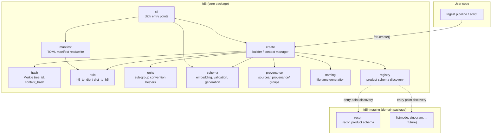

# DES-001: fd5 SDK Architecture

| Field | Value |
|-------|-------|
| **Status** | `accepted` |
| **Date** | 2026-02-25 |
| **Author** | @gerchowl |
| **RFC** | [RFC-001](../rfcs/RFC-001-2026-02-25-fd5-core-implementation.md) |
| **Issue** | #10 |

## Overview

This document defines the architecture for the `fd5` Python SDK — the core
library that creates, validates, and inspects FAIR-principled, immutable HDF5
data product files. It covers Phases 1–2 of
[RFC-001](../rfcs/RFC-001-2026-02-25-fd5-core-implementation.md): the core SDK
and the first domain schema (`recon`).

### Key requirements driving architecture

1. **Write-once immutability** — files are created atomically and never modified
2. **Streaming hash** — content hash computed inline during creation, no
   second pass
3. **Domain extensibility** — new product schemas added without modifying core
4. **Self-describing** — every file embeds its own JSON Schema
5. **Round-trip metadata** — Python dicts ↔ HDF5 groups/attrs losslessly

## Architecture

### Pattern: Builder + Plugin Registry + 2-Layer Architecture

| Pattern | Role in fd5 |
|---------|-------------|
| **Builder (context-manager)** | `fd5.create()` returns a builder that accumulates data/metadata, computes hashes inline, and seals the file on `__exit__` |
| **Plugin registry (entry points)** | Domain packages register product schemas via `importlib.metadata` entry points; core discovers them at runtime |
| **2-layer architecture** | Layer 1: `fd5` core (conventions, hashing, I/O, validation, CLI). Layer 2: domain packages (e.g., `fd5-imaging`) providing product schemas |

### Key decisions

| Decision | Choice | Rationale |
|----------|--------|-----------|
| Plugin mechanism | `importlib.metadata` entry points | Standard Python packaging; no custom plugin loader; works with pip/uv |
| Hash algorithm | SHA-256 via `hashlib` | Whitepaper specifies SHA-256; `"sha256:"` prefix allows future algorithm changes without code changes |
| Compression | gzip level 4 (h5py default filter) | Whitepaper specifies gzip; level 4 balances speed and ratio for scientific data |
| Schema format | JSON Schema Draft 2020-12 | Whitepaper specifies JSON Schema; `jsonschema` library supports this draft |
| Manifest format | TOML | Whitepaper specifies TOML; `tomllib` is stdlib since 3.11 |
| Config/settings | None (convention over configuration) | The fd5 format is prescriptive; no user-facing configuration needed for core behavior |
| Async support | None | Write-once file creation is I/O-bound but sequential; async adds complexity without benefit |

## Components

### Component topology



### Component responsibilities

#### `fd5.h5io` — HDF5 metadata I/O

| Aspect | Detail |
|--------|--------|
| **Responsibility** | Lossless round-trip between Python dicts and HDF5 groups/attrs |
| **Public API** | `h5_to_dict(group) -> dict`, `dict_to_h5(group, d)` |
| **Key rules** | Attrs only (never datasets); `None` → absent attr; numpy arrays → datasets (handled by caller); sorted keys for determinism |
| **Dependencies** | `h5py`, `numpy` |

Type mapping follows the whitepaper §Implementation Notes exactly:

| Python → HDF5 | HDF5 → Python |
|---------------|---------------|
| `dict` → sub-group | sub-group → `dict` |
| `str` → UTF-8 attr | string attr → `str` |
| `int` → int64 attr | scalar int → `int` |
| `float` → float64 attr | scalar float → `float` |
| `bool` → numpy.bool_ attr | scalar bool → `bool` |
| `list[number]` → numpy array attr | array attr (numeric) → `list` |
| `list[str]` → vlen string array attr | array attr (string) → `list[str]` |
| `None` → skip (absent) | absent → `None` (caller handles) |

#### `fd5.units` — Physical quantity convention

| Aspect | Detail |
|--------|--------|
| **Responsibility** | Create/read sub-groups following the `value`/`units`/`unitSI` pattern; attach `units`/`unitSI` attrs to datasets |
| **Public API** | `write_quantity(group, name, value, units, unit_si)`, `read_quantity(group, name) -> (value, units, unit_si)`, `set_dataset_units(dataset, units, unit_si)` |
| **Dependencies** | `h5py` |

#### `fd5.hash` — Hashing and integrity

| Aspect | Detail |
|--------|--------|
| **Responsibility** | Compute `id` from identity inputs; compute per-chunk hashes; build Merkle tree; compute `content_hash`; verify integrity |
| **Public API** | `compute_id(inputs, id_inputs_desc) -> str`, `ChunkHasher` (streaming per-chunk), `MerkleTree` (accumulates group/dataset/attr hashes), `verify(path) -> bool` |
| **Key rules** | Exclude `content_hash` attr from Merkle tree; exclude `_chunk_hashes` datasets; sorted keys; row-major byte order |
| **Dependencies** | `hashlib` (stdlib), `numpy` |

Streaming workflow during file creation:

```
open file → for each dataset:
    write chunk → hash chunk → accumulate into dataset hash
→ for each group:
    hash sorted attrs → accumulate into group hash
→ finalize Merkle root → write content_hash attr → close file
```

#### `fd5.schema` — Schema embedding and validation

| Aspect | Detail |
|--------|--------|
| **Responsibility** | Embed `_schema` JSON attr at root; validate file against embedded schema; generate JSON Schema from product schema definition; dump schema to file |
| **Public API** | `embed_schema(file, schema_dict)`, `validate(path) -> list[ValidationError]`, `dump_schema(path) -> dict`, `generate_schema(product_type) -> dict` |
| **Dependencies** | `jsonschema`, `json` (stdlib) |

#### `fd5.provenance` — Provenance groups

| Aspect | Detail |
|--------|--------|
| **Responsibility** | Write `sources/` group with external links and metadata attrs; write `provenance/original_files` compound dataset; write `provenance/ingest/` attrs |
| **Public API** | `write_sources(file, sources_list)`, `write_original_files(file, file_records)`, `write_ingest(file, tool, version, timestamp)` |
| **Dependencies** | `h5py`, `numpy` |

Source record structure:

```python
@dataclass
class SourceRecord:
    name: str           # group name under sources/
    id: str             # sha256:... of source product
    product: str        # source product type
    file: str           # relative path hint
    content_hash: str   # sha256:... for integrity
    role: str           # semantic role (e.g., "emission_data")
    description: str
```

#### `fd5.naming` — Filename generation

| Aspect | Detail |
|--------|--------|
| **Responsibility** | Generate `YYYY-MM-DD_HH-MM-SS_<product>-<id>_<descriptors>.h5` filenames |
| **Public API** | `generate_filename(product, id_hash, timestamp, descriptors) -> str` |
| **Dependencies** | None (stdlib only) |

#### `fd5.manifest` — TOML manifest

| Aspect | Detail |
|--------|--------|
| **Responsibility** | Scan a directory of fd5 files; extract root attrs; write `manifest.toml`; read/parse manifest |
| **Public API** | `build_manifest(directory) -> dict`, `write_manifest(directory, output_path)`, `read_manifest(path) -> dict` |
| **Dependencies** | `h5py`, `tomllib` (stdlib), `tomli-w` |

#### `fd5.registry` — Product schema registry

| Aspect | Detail |
|--------|--------|
| **Responsibility** | Discover and register product schemas from entry points; look up schema by product type string; provide schema metadata (required fields, JSON Schema) |
| **Public API** | `get_schema(product_type) -> ProductSchema`, `list_schemas() -> list[str]`, `register_schema(product_type, schema)` (for testing/dynamic use) |
| **Dependencies** | `importlib.metadata` (stdlib) |

Entry point group: `fd5.schemas`

```toml
# In fd5-imaging's pyproject.toml:
[project.entry-points."fd5.schemas"]
recon = "fd5_imaging.recon:ReconSchema"
```

`ProductSchema` protocol:

```python
class ProductSchema(Protocol):
    product_type: str
    schema_version: int
    def json_schema(self) -> dict: ...
    def required_root_attrs(self) -> set[str]: ...
    def write(self, builder: Fd5Builder, **kwargs) -> None: ...
    def id_inputs(self, **kwargs) -> list[str]: ...
```

#### `fd5.create` — File builder

| Aspect | Detail |
|--------|--------|
| **Responsibility** | Orchestrate file creation: open HDF5, write root attrs, delegate to product schema, compute hashes, seal file |
| **Public API** | `create(path, product, **kwargs) -> Fd5Builder` (context-manager) |
| **Dependencies** | All other `fd5.*` modules |

Builder lifecycle:

```
with fd5.create(path, product="recon", ...) as f:
    # 1. File opened, MerkleTree initialized
    # 2. Root attrs written (product, name, description, timestamp, ...)
    f.write_volume(data, affine=...)       # delegates to product schema
    f.write_metadata(metadata_dict)        # uses h5io.dict_to_h5
    f.write_sources(sources)               # uses provenance module
    f.write_provenance(original_files=...) # uses provenance module
    f.write_study(study_dict)              # study/ group
    # 3. On __exit__:
    #    - Schema generated and embedded
    #    - Merkle tree finalized → content_hash written
    #    - id computed from identity inputs → id attr written
    #    - File closed (sealed, immutable)
```

#### `fd5.cli` — Command-line interface

| Aspect | Detail |
|--------|--------|
| **Responsibility** | CLI entry points: `fd5 validate`, `fd5 info`, `fd5 schema-dump`, `fd5 manifest` |
| **Public API** | Click command group |
| **Dependencies** | `click`, all other `fd5.*` modules |

| Command | Description |
|---------|-------------|
| `fd5 validate <file>` | Validate file against embedded schema; verify content_hash |
| `fd5 info <file>` | Print root attrs and structure summary |
| `fd5 schema-dump <file>` | Extract and print embedded `_schema` JSON |
| `fd5 manifest <dir>` | Generate `manifest.toml` from fd5 files in directory |

#### `fd5_imaging.recon` — Recon product schema (domain package)

| Aspect | Detail |
|--------|--------|
| **Responsibility** | Define `recon` product type: volume dataset, pyramid, MIPs, frames; implement `ProductSchema` protocol |
| **Public API** | `ReconSchema` class; builder methods: `write_volume()`, `write_pyramid()`, `write_mips()`, `write_frames()` |
| **Dependencies** | `fd5` (core), `numpy`, `h5py` |

## Data Flow

### Happy path: create a recon file

```
User calls fd5.create(path, product="recon", name=..., timestamp=...)
  → Builder opens HDF5 file for writing
  → Builder writes common root attrs (product, name, description, timestamp)
  → MerkleTree accumulator initialized

User calls builder.write_volume(data, affine=...)
  → ReconSchema.write() called
  → Volume dataset written chunk-by-chunk
  → Each chunk hashed inline → ChunkHasher accumulates
  → Optional: _chunk_hashes companion dataset written
  → MIP projections computed and written

User calls builder.write_metadata(dict)
  → dict_to_h5 writes nested groups/attrs
  → Attrs hashed as written

User calls builder.write_sources([...])
  → sources/ group created with external links + attrs

Context manager __exit__:
  → JSON Schema generated from product schema definition
  → _schema attr written to root
  → id computed from identity inputs → id attr written
  → MerkleTree finalized → content_hash attr written
  → File closed and sealed
```

### Happy path: validate a file

```
User calls fd5 validate <file>
  → Open file read-only
  → Read _schema attr → parse JSON Schema
  → Validate file structure against schema → report errors
  → Read content_hash attr
  → Recompute Merkle tree from file contents
  → Compare → report match/mismatch
```

### Error paths

| Error | Handling |
|-------|----------|
| Builder `__exit__` after exception | File is deleted (incomplete files must not exist) |
| Unknown product type | `ValueError` at `fd5.create()` time with list of known types |
| Missing required attr during seal | `Fd5ValidationError` listing missing fields |
| Schema validation failure | Returns structured `list[ValidationError]` with paths |
| Content hash mismatch on verify | Returns `IntegrityError` with expected vs actual hash |
| Corrupt HDF5 file on read | `h5py` raises `OSError`; fd5 wraps with context |

## Technology Stack

| Layer | Technology | Version constraint | Rationale |
|-------|-----------|-------------------|-----------|
| Language | Python | ≥ 3.12 | Already set in `pyproject.toml`; `tomllib` stdlib, modern typing |
| HDF5 binding | `h5py` | ≥ 3.10 | Mature, actively maintained, standard |
| Arrays | `numpy` | ≥ 2.0 | Required by h5py; already in science extras |
| Hashing | `hashlib` | stdlib | SHA-256, no external dependency |
| Schema validation | `jsonschema` | ≥ 4.20 | JSON Schema Draft 2020-12 support |
| TOML write | `tomli-w` | ≥ 1.0 | Small, stable; read via stdlib `tomllib` |
| CLI | `click` | ≥ 8.0 | Clean subcommand pattern; widely used |
| Testing | `pytest` | ≥ 8.0 | Already in dev extras |
| Build | `hatchling` | ≥ 1.25 | Already in `pyproject.toml` |

### Package structure

```
src/
  fd5/
    __init__.py          # public API re-exports
    create.py            # Fd5Builder context-manager
    h5io.py              # h5_to_dict / dict_to_h5
    hash.py              # ChunkHasher, MerkleTree, compute_id, verify
    units.py             # physical quantity convention helpers
    schema.py            # embedding, validation, generation
    provenance.py        # sources/, provenance/ group writers
    naming.py            # filename generation
    manifest.py          # TOML manifest build/read/write
    registry.py          # product schema discovery via entry points
    cli.py               # click command group
    _types.py            # shared protocols, dataclasses, type aliases
    py.typed             # PEP 561 marker

# Separate package (Phase 2, same repo initially):
  fd5_imaging/
    __init__.py
    recon.py             # ReconSchema: volume, pyramid, MIPs, frames
```

## Testing Strategy

| Level | Scope | Tools |
|-------|-------|-------|
| **Unit** | Each module independently: `h5io` round-trips, `hash` determinism, `units` read/write, `naming` format, `registry` discovery | `pytest`, `tmp_path` fixture for HDF5 files |
| **Integration** | Full `fd5.create()` → `fd5 validate` round-trip; manifest generation from multiple files; product schema registration via entry points | `pytest`, `tmp_path` |
| **Property-based** | `h5_to_dict(dict_to_h5(d)) == d` for generated dicts; hash determinism across runs | `hypothesis` (optional, add if useful) |
| **Regression** | One reference fd5 file per product type committed as test fixture; validate against known-good hashes | `pytest`, committed fixtures |

Target: ≥ 90% line coverage on core (per RFC success criteria).

## Blind Spots Addressed

### Observability

Not applicable in the traditional sense (no running service). Observability is
via:
- **CLI output**: `fd5 validate` and `fd5 info` provide file-level diagnostics
- **Logging**: Python `logging` module at DEBUG level for hash computation
  steps, schema validation details
- **Error messages**: Structured errors with file path, group path, expected vs
  actual values

### Security

- **No secrets**: fd5 processes local files; no authentication, no network
  access, no credentials
- **Data integrity**: `content_hash` detects tampering; file signing is
  out of scope (R6) but the hash infrastructure supports it as a future layer
- **Input validation**: Untrusted HDF5 files are validated via schema before
  any data interpretation

### Scalability

- **File size**: HDF5 handles multi-GB files natively; chunked I/O prevents
  memory exhaustion
- **Directory scale**: Manifest generation iterates files lazily; no full
  in-memory collection needed
- **Parallel creation**: Multiple processes create independent files
  concurrently (no shared state)

### Reliability

- **Crash safety**: If builder `__exit__` is reached via exception, the
  incomplete file is deleted. No partial fd5 files can exist on disk.
- **Determinism**: Same inputs always produce same `content_hash` (sorted keys,
  row-major byte order, deterministic Merkle tree)

### Data consistency

Not applicable — fd5 files are immutable. No concurrent updates. No consistency
model needed. The write-once, read-many model eliminates this class of problems
entirely.

### Deployment

This is a library installed via `pip install fd5`. No deployment infrastructure.
Published to PyPI. CLI available as `fd5` console script entry point.

### Configuration

Convention over configuration. The fd5 format is prescriptive: SHA-256, gzip
level 4, JSON Schema, TOML manifest. No user-facing configuration files. The
only extension point is product schema registration via entry points.

## Deviation Justification

### No abstract backend (HDF5 only)

Standard library architecture would suggest abstracting the storage backend
behind an interface to allow swapping HDF5 for Zarr, SQLite, etc.

**Deviation:** fd5 directly depends on `h5py` with no storage abstraction layer.

**Justification:** The whitepaper makes a deliberate, well-argued choice of HDF5
(see §HDF5 cloud compatibility). An abstraction layer would add indirection with
no near-term benefit — there is no second backend planned. The `h5io` module
provides a natural seam if abstraction is ever needed (A1 assumption, low risk).

### No async API

Modern Python libraries often provide async variants for I/O operations.

**Deviation:** fd5 is synchronous only.

**Justification:** File creation is a sequential write pipeline (data → hash →
metadata → seal). HDF5 itself is not async-friendly (the C library uses
blocking I/O). Parallelism happens across files (multiple processes), not within
a single file write. Adding async would increase API surface and complexity with
no throughput benefit.

### Entry points over explicit registration

Some plugin systems use explicit `register()` calls or config-file based
discovery.

**Deviation:** fd5 uses `importlib.metadata` entry points exclusively.

**Justification:** Entry points are the standard Python mechanism for plugin
discovery. They work with all package managers (pip, uv, conda), require no
runtime registration calls, and enable `fd5` core to have zero knowledge of
domain packages at build time. The `register_schema()` escape hatch exists for
testing only.

## Implementation Issues

### Phase 1: Core SDK

- #21 — Add project dependencies
- #12 — `fd5.h5io` (h5_to_dict / dict_to_h5)
- #13 — `fd5.units` (physical quantity convention)
- #24 — [SPIKE] h5py streaming chunk write + inline hashing
- #14 — `fd5.hash` (Merkle tree, content_hash, id)
- #15 — `fd5.schema` (embedding, validation, generation)
- #16 — `fd5.provenance` (sources/, provenance/ groups)
- #17 — `fd5.registry` (product schema discovery)
- #18 — `fd5.naming` (filename generation)
- #20 — `fd5.manifest` (TOML manifest)
- #19 — `fd5.create` (builder / context-manager)

### Phase 2: Recon Schema + CLI

- #22 — `fd5_imaging.recon` (recon product schema)
- #23 — `fd5.cli` (validate, info, schema-dump, manifest)

### Phase 3: Medical Imaging Schemas (Epic #61)

- #51 — `fd5_imaging.listmode` (event-based data)
- #52 — `fd5_imaging.sinogram` (projection data)
- #53 — `fd5_imaging.sim` (simulation)
- #54 — `fd5_imaging.transform` (spatial registrations)
- #55 — `fd5_imaging.calibration` (detector/scanner calibration)
- #56 — `fd5_imaging.spectrum` (histogrammed/binned data)
- #57 — `fd5_imaging.roi` (regions of interest)
- #58 — `fd5_imaging.device_data` (device signals)

### Phase 4: FAIR Export Layer

- #59 — `fd5.rocrate` (RO-Crate JSON-LD generation)
- #60 — `fd5.datacite` (DataCite metadata export)
