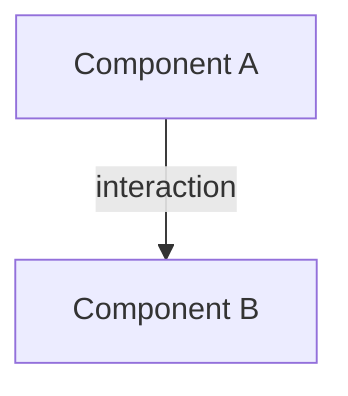

# DES-XXX: Title

| Field | Value |
|-------|-------|
| **Status** | `proposed` / `accepted` / `rejected` |
| **Date** | YYYY-MM-DD |
| **Author** | Name |
| **RFC** | [RFC-XXX](../rfcs/RFC-XXX-YYYY-MM-DD-title.md) |
| **Issue** | #N |

## Overview

What system is being designed? Link to RFC. Summarize the architecture approach.

## Architecture

### Pattern chosen

Which architecture pattern(s) and why.

### Key decisions

Major technical decisions with rationale.

## Components

### Component topology

### Component responsibilities

For each component: responsibility, public API, dependencies.

## Data Flow

### Happy path

Step-by-step flow for the primary use case.

### Error paths

How errors are handled at each stage.

## Technology Stack

Language, frameworks, libraries with version constraints and rationale.

## Testing Strategy

Unit, integration, E2E approach. Coverage targets.

## Blind Spots Addressed

Observability, security, scalability, reliability, data consistency, deployment,
configuration — how each is handled or why it's not applicable.

## Deviation Justification

Where the design deviates from standard patterns, why, and what risks are
accepted.
